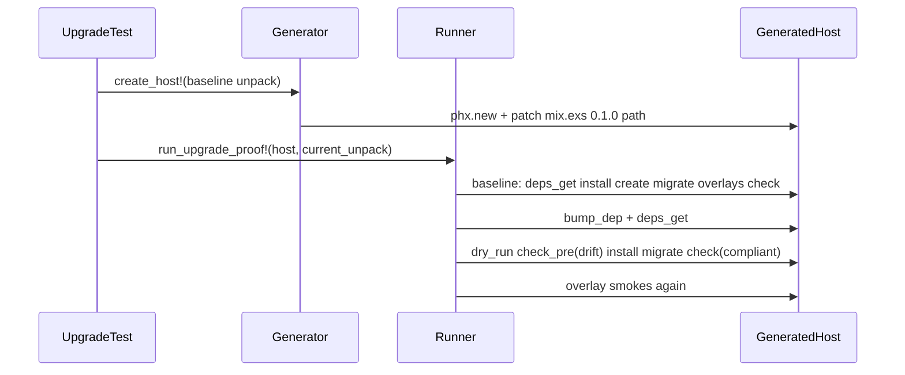

# Phase 80: Upgrade smoke in adoption lane — Research

**Researched:** 2026-05-29
**Status:** Ready for planning

## RESEARCH COMPLETE

---

## Executive Summary

Phase 80 delivers **HEX-UPGRADE-01**: a dedicated `host_app_upgrade_proof_test.exs` in the adoption lane that uses **one** generated Phoenix host, installs from a **committed** `v0.1.0` unpack fixture, runs full overlay smokes + compliant `--check`, bumps the `mix.exs` path dep to the **current** `hex.build --unpack` tarball, runs the operator upgrade chain (`--dry-run` → pre-apply `--check` → apply → `ecto.migrate` → post `--check`), then re-runs overlay smokes — without a second `phx.new`.

The codebase already has the Phase 78–79 harness (`HexConsumerContract`, `Generator`, `Runner.run_full_proof!/1`, failure snapshots). Phase 80 adds baseline fixture infrastructure, `run_upgrade_proof!/2`, and adoption-lane registration. Migration ordering proof is **latent** today (24 identical core migrations at `v0.1.0` and HEAD); the harness ships now and documents criterion #4 for first post-0.1.0 migration.

---

## Standard Stack

| Component | Role | Notes |
|-----------|------|-------|
| `mix hex.build --unpack` | Tarball artifact for CI | Hex #515 path dep pattern [CITED: hex docs / 78-RESEARCH] |
| `Scoria.HexConsumerContract` | Dep tuples, fingerprints, unpack cache | Extend with baseline fixture APIs |
| `Scoria.TestSupport.HostAppProof.*` | phx.new host + proof steps | New `run_upgrade_proof!/2` — do not extend `run_full_proof!/1` |
| `mix scoria.install` | dry-run / check / apply | Trailer SSOT: `SCORIA_CHECK_RESULT status=… exit_code=…` |
| `mix test.adoption` | Merge-blocking lane | Add upgrade test file to `@adoption_test_files` |

---

## Codebase Findings [VERIFIED: grep/read]

### Existing assets

- `HexConsumerContract.baseline_upgrade_version/0` → `"0.1.0"` (hook only; no fixture dir yet)
- `HexConsumerContract.ensure_current_unpack_root!/0` — fingerprint cache under `tmp/scoria-hex-consumer/`
- `HexConsumerContract.package_fingerprint/0` — HEAD fingerprint `4f209a48f836` [VERIFIED: mix run 2026-05-29]
- `Runner.run_full_proof!/1` + `expected_steps/1` — baseline segment pattern for upgrade SSOT
- `Generator.create_host!(dep_mode: :hex_tarball, unpack_root: …)` — patch mix.exs path dep
- `host_app_consumer_proof_test.exs` — `@moduletag :host_proof`, 180_000, unchanged
- `Mix.Tasks.Scoria.Test.Adoption` — **does not** yet list upgrade test (lines 5–18 `lib/mix/tasks/test.adoption.ex`)
- **No** `test/fixtures/hex_consumer/` directory yet — Wave 1 creates from `v0.1.0` tag [VERIFIED: glob]

### Installer modes for upgrade chain [VERIFIED: lib/mix/tasks/scoria.install.ex]

| Step | Command | Expected exit | Trailer |
|------|---------|---------------|---------|
| Dry-run | `mix scoria.install --dry-run` | 0 | plan only, no trailer required |
| Pre-apply check | `mix scoria.install --check` | 1 | `SCORIA_CHECK_RESULT status=drift exit_code=1` |
| Apply | `mix scoria.install` | 0 | — |
| Post check | `mix scoria.install --check` | 0 | `SCORIA_CHECK_RESULT status=compliant exit_code=0` |

Pins match `test/mix/tasks/scoria.install_check_test.exs` (D-60).

### Migration delta honesty [VERIFIED: git diff]

- `v0.1.0` tag exists at `49f2d60018c4c79fbc09969116526c48454a8e84`
- 24 migration files at tag and HEAD; **identical basenames**, paths differ only by `priv/repo/migrations/` prefix in tree listing
- Post-upgrade `ecto.migrate` is no-op until first post-0.1.0 migration ships (D-65)

### Timing budget [ASSUMED from 79-RESEARCH + CONTEXT D-63]

| Context | p50 | p95 | Module tag |
|---------|-----|-----|------------|
| Consumer (`:host_proof`) | ~50–58s | ≤90s | 180_000 (unchanged) |
| Upgrade (`:host_upgrade`) | ~100–116s | ≤120s | 180_000 at ship; 240_000 only after CI >120s twice (D-37) |
| Full `mix test.adoption` | ~165–175s incremental | — | Inherits per-module tags |

---

## Architecture: Upgrade Proof Flow



**Step SSOT (D-58):**

```elixir
# Baseline
[:deps_get, :scoria_install, :ecto_create, :ecto_migrate] ++ overlay_atoms ++ [:scoria_install_check]

# Upgrade (same host, same DB)
[:bump_dep, :deps_get, :scoria_install_dry_run, :scoria_install_check_pre_apply,
 :scoria_install, :ecto_migrate, :scoria_install_check] ++ overlay_atoms
```

---

## Recommended Plan Split

| Plan | Wave | Delivers |
|------|------|----------|
| 80-01 | 1 | Committed `scoria-0.1.0-unpack/`, baseline contract APIs, refresh task, drift tests |
| 80-02 | 2 | `run_upgrade_proof!/2`, `expected_upgrade_steps/1`, `bump_unpack_dep!/2`, trailer/exit helpers, MANIFEST upgrade fields |
| 80-03 | 3 | `host_app_upgrade_proof_test.exs`, adoption wiring, fingerprint assertion, closeout artifacts |

---

## Pitfalls

| Risk | Mitigation |
|------|------------|
| Fixture rebuilt from HEAD | Committed tree + stamp vs `baseline_package_fingerprint/0` (D-51) |
| `published_version == baseline` skips test | Rejected — assert `baseline_fp != current_fp` (D-54) |
| Extending `run_full_proof!/1` with phases | Rejected — semantic lie; dedicated `run_upgrade_proof!/2` (D-57) |
| Co-locating upgrade in consumer test | Rejected — breaks `:host_proof` fast loop (D-61) |
| Synthetic trap migration | Rejected — latent criterion #4 (D-64–D-65) |
| Sticky deps after bump | `mix deps.clean scoria` if needed after `bump_unpack_dep!/2` (D-59) |
| Preemptive 300s timeout | Rejected — D-37 evidence-only escalation (D-63) |

---

## Integration Points (Phases 81–82)

| Phase | Relationship |
|-------|----------------|
| 81 | Live `hex: :scoria` registry upgrade — separate from path tarball |
| 82 | README/operator prose + drift pins for upgrade narrative |

---

## Validation Architecture

Nyquist mapping: HEX-UPGRADE-01 → executable commands with timing budgets.

### Test framework

| Property | Value |
|----------|-------|
| Framework | ExUnit |
| Adoption lane | `mix test.adoption` |
| Upgrade proof timeout | `@moduletag timeout: 180_000` on `HostAppUpgradeProofTest` |
| Local iteration | `@moduletag :host_upgrade` → `mix test --only host_upgrade` |
| Postgres | Required (preserved DB across upgrade) |

### Requirement → test map

| Req ID | Behavior | Test type | Command | Exists? |
|--------|----------|-----------|---------|---------|
| HEX-UPGRADE-01 | Baseline 0.1.0 install + overlays + check | integration | `mix test test/scoria/host_app_upgrade_proof_test.exs` | ❌ add |
| HEX-UPGRADE-01 | Content-revision bump + installer chain | integration | same (`run_upgrade_proof!/2`) | ❌ add |
| HEX-UPGRADE-01 | `baseline_fp != current_fp` | unit/assert | upgrade test setup | ❌ add |
| HEX-UPGRADE-01 | Exact `expected_upgrade_steps/1` | integration | step list assertion | ❌ add |
| HEX-UPGRADE-01 | Adoption lane green | lane | `mix test.adoption` | ❌ extend list |
| HEX-UPGRADE-01 | Fixture drift guard | unit | `hex_consumer_contract_test` / policy test | ❌ add |
| HEX-UPGRADE-01 | Migration ordering (latent) | contract doc | `80-VERIFICATION.md` criterion #4 | ❌ add |

### Sampling rate

| When | Command |
|------|---------|
| After 80-01 | `mix test test/scoria/hex_consumer_contract_test.exs` + fixture stamp test |
| After 80-02 | compile + optional isolated runner unit if added |
| After 80-03 | `mix test --only host_upgrade` then `mix test.adoption` |
| Phase gate | `mix test.adoption` green |

### Failure triage

| Symptom | First check |
|---------|-------------|
| `:scoria_install_check_pre_apply` wrong exit | dep bump applied? trailer pin drift? |
| `:bump_dep` / `:deps_get` fail | `mix.exs` path rewrite; `deps.clean scoria` |
| Overlay fail post-upgrade | `SCORIA_PRESERVE_HOST=1`; MANIFEST `upgrade_phase` |
| Fixture fingerprint mismatch | run `mix scoria.hex_consumer.refresh_baseline_fixture` |

---

## Project Constraints (from .cursor/rules/)

No `.cursor/rules/` overrides discovered for this phase beyond standard Elixir/ExUnit conventions.

---

## Sources

- `.planning/phases/80-upgrade-smoke-in-adoption-lane/80-CONTEXT.md` — locked decisions D-50–D-68
- `.planning/phases/79-tarball-consumer-overlay-proof/79-RESEARCH.md` — §12 integration, timing
- `test/support/scoria/host_app_proof/runner.ex`, `generator.ex`, `lib/scoria/hex_consumer_contract.ex` — [VERIFIED: read]
- `lib/mix/tasks/test.adoption.ex` — adoption file list [VERIFIED: read]
