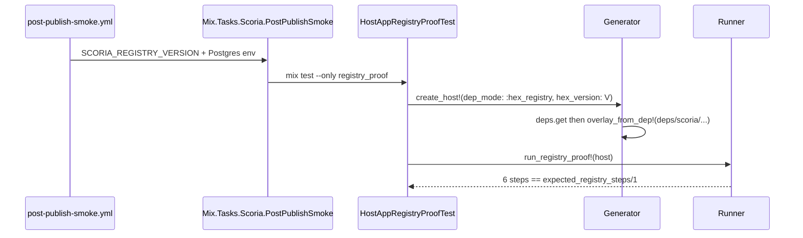

# Phase 81: Post-publish registry gate — Research

**Researched:** 2026-05-29
**Status:** Ready for planning

## RESEARCH COMPLETE

---

## Executive Summary

Phase 81 delivers **HEX-REGISTRY-01**: replace compile-only post-publish smoke with **live Hex registry** consumer proof using the existing `HostAppProof` harness (`:hex_registry` dep mode), a maintainer `mix scoria.post_publish_smoke` entrypoint, and a **blocking** `workflow_call` job chained after `publish-hex` in `release-please.yml` and `hex-publish.yml`.

The codebase today has `post-publish-smoke.yml` as a standalone workflow triggered on `release: published` that races ahead of `publish-hex` and only runs `mix deps.get` + `compile` with `~> 0.1` in a throwaway project [VERIFIED: read `.github/workflows/post-publish-smoke.yml`]. Phases 78–80 built `HexConsumerContract`, `Generator` (`:hex_tarball` | `:path`), and `Runner.run_upgrade_proof!/2` for tarball adoption — Phase 81 extends the same modules for registry pins and subset overlays (route + runtime only, 6 steps).

---

## Standard Stack

| Component | Role | Notes |
|-----------|------|-------|
| `{:scoria, "X.Y.Z", hex: :scoria}` | Live registry dep | Exact pin for fresh install; not `~> 0.1` during index lag [CONTEXT D-73] |
| `Scoria.HexConsumerContract` | Registry/semver SSOT | Extend with pinned tuple/snippet + upgrade pair helpers |
| `Scoria.TestSupport.HostAppProof.*` | phx.new host + proof | `:hex_registry`, `overlay_from_dep!/1`, `run_registry_proof!/1` |
| `mix scoria.post_publish_smoke` | Release attest entry | Reads `SCORIA_REGISTRY_VERSION`; not in `mix test.adoption` |
| `post-publish-smoke.yml` | Reusable `workflow_call` | Inputs: `version`, `skip_index_wait` |
| Postgres (pgvector 55432) | Runtime overlay DB | Mirror `ci-verify.yml` test job env [VERIFIED: read ci-verify.yml] |

---

## Codebase Findings [VERIFIED: grep/read]

### Current post-publish (to replace)

- `post-publish-smoke.yml`: `on.release.published` + `workflow_dispatch`; inline `mix new` + `elixir -e` patch with `~> 0.1`; no install/migrate/overlays/Postgres
- `release-please.yml` `publish-hex`: 36×10s Hex index wait already; no downstream attest job
- `hex-publish.yml`: manual recovery publish; no post-publish attest

### Harness assets (reuse)

- `Generator.create_host!/1` — only `:hex_tarball` and `:path` today; overlays from `overlay_source` kw (default repo root) [VERIFIED: generator.ex]
- `Generator.overlay_test_files_from/1` — wildcard `priv/host_app_proof/overlay/test/*.exs` (handoff, route, runtime)
- `Runner.run_route_proof!/1` — 5 steps (route overlay only); registry needs 6 with runtime
- `Runner.run_upgrade_proof!/2` + `bump_unpack_dep!/2` — tarball path bump; extend dispatch for `{:registry, from:, to:}`
- `HexConsumerContract.hex_dep_tuple/0` → `{:scoria, "~> 0.1", hex: :scoria}` — add pinned variants
- Overlays packaged in Hex artifact at `deps/scoria/priv/host_app_proof/overlay/test/` after `deps.get` [CONTEXT D-70]

### Overlay subset (registry)

| File | In registry proof? |
|------|-------------------|
| `host_route_smoke_test.exs` | Yes |
| `host_runtime_smoke_test.exs` | Yes |
| `host_handoff_smoke_test.exs` | No (tarball adoption owns HOST-02) |

**Registry step SSOT (D-69, D-71):**

```elixir
[:deps_get, :scoria_install, :ecto_create, :ecto_migrate,
 :host_route_smoke_test, :host_runtime_smoke_test]
```

### Semver upgrade (conditional)

- `Version.compare(version, "0.1.0") == :gt` → run `run_upgrade_proof!/2` with registry bump [D-83–D-87]
- At `0.1.0` only: fresh-install attest; upgrade documented latent in `81-VERIFICATION.md` [D-83, mirror 80 D-65]
- Baseline leg: exact previous semver pin; upgrade target: exact just-published — reject `~> 0.1` on baseline [D-85]
- Post-upgrade migration delta assertion latent until first post-0.1.0 core migration [D-87]

### Timing budget [ASSUMED from 79–80 + CONTEXT]

| Context | Estimate | Module tag |
|---------|----------|------------|
| Registry fresh install | ~60–90s | `@moduletag timeout: 180_000` on `:registry_proof` |
| Registry semver upgrade | ~100–130s | `:registry_upgrade` env-gated |
| Post-publish CI job | ~3–8 min incl. phx.new + Postgres | Workflow timeout ≥15m recommended |

---

## Architecture: Registry Proof Flow



**Workflow topology (D-77–D-79):**


Remove reliance on `release: published` as primary gate — it fires before `publish-hex` completes.

---

## Recommended Plan Split

| Plan | Wave | Delivers |
|------|------|----------|
| 81-01 | 1 | `HexConsumerContract` registry/semver APIs; `Generator` `:hex_registry`, `overlay_from_dep!/1`, `bump_registry_dep!/2` |
| 81-02 | 2 | `Runner` registry proof + upgrade dispatch; ExUnit modules; `mix scoria.post_publish_smoke`; contract tests |
| 81-03 | 3 | `workflow_call` refactor; blocking jobs in release-please + hex-publish; operator gate map stub; `81-VERIFICATION.md` |

---

## Pitfalls

| Risk | Mitigation |
|------|------------|
| Overlay copied from checkout | `overlay_from_dep!/1` after `deps.get` from `deps/scoria/priv/...` [D-70] |
| `~> 0.1` resolves stale index | Exact version pin `{:scoria, "#{V}", hex: :scoria}` [D-73] |
| `release: published` races publish-hex | `needs: publish-hex` + `skip_index_wait: true` [D-77–D-82] |
| Inline YAML shell drift | Mix task + Runner SSOT [D-72] |
| Registry proof in adoption lane | Separate `@moduletag :registry_proof`; not in `test.adoption.ex` [D-75] |
| Upgrade no-op (both legs same version) | Exact pinned baseline `0.1.0` not `~> 0.1` [D-85] |
| Missing Postgres in post-publish | pgvector service + `SCORIA_DB_PORT=55432` [D-81] |

---

## Integration Points

| Phase | Relationship |
|-------|----------------|
| 78–79 | Tarball full overlay + PR CI — unchanged |
| 80 | Tarball content-revision upgrade in adoption — complementary |
| 82 | Full operator/README narrative + drift pins |

---

## Validation Architecture

Nyquist mapping: HEX-REGISTRY-01 → executable commands with timing budgets.

### Test framework

| Property | Value |
|----------|-------|
| Framework | ExUnit |
| Release lane | `mix scoria.post_publish_smoke` (not adoption) |
| Fresh install tag | `@moduletag :registry_proof` |
| Upgrade tag | `@moduletag :registry_upgrade` (env/semver gated) |
| Local iteration | `SCORIA_REGISTRY_VERSION=0.1.0 mix scoria.post_publish_smoke` |
| Postgres | Required (55432 in CI, 5432 local default) |

### Requirement → test map

| Req ID | Behavior | Test type | Command | Exists? |
|--------|----------|-----------|---------|---------|
| HEX-REGISTRY-01 | Registry dep exact pin helpers | unit | `mix test test/scoria/hex_consumer_contract_test.exs` | ❌ extend |
| HEX-REGISTRY-01 | Fresh install 6-step registry proof | integration | `mix test --only registry_proof` | ❌ add |
| HEX-REGISTRY-01 | Conditional semver upgrade | integration | upgrade module when version > 0.1.0 | ❌ add |
| HEX-REGISTRY-01 | Mix task entrypoint | task | `SCORIA_REGISTRY_VERSION=X mix scoria.post_publish_smoke` | ❌ add |
| HEX-REGISTRY-01 | Blocking release workflow | workflow | `release-please` attest job | ❌ add |
| HEX-REGISTRY-01 | Operator gate map row | doc/contract | `docs/operator_verification.md` | ❌ stub |
| HEX-REGISTRY-01 | Latent migration criterion | doc | `81-VERIFICATION.md` | ❌ add |

### Sampling rate

| When | Command |
|------|---------|
| After 81-01 | `MIX_ENV=test mix compile --warnings-as-errors` + contract unit tests |
| After 81-02 | `SCORIA_REGISTRY_VERSION=0.1.0 mix scoria.post_publish_smoke` (requires live Hex + Postgres) |
| After 81-03 | Workflow YAML lint / `mix test test/scoria/ci_policy_contract_test.exs` if extended |
| Phase gate | Manual or release dry-run of `workflow_call` with `skip_index_wait: true` |

### Failure triage

| Symptom | First check |
|---------|-------------|
| `:deps_get` fails | Hex index lag; retry; `SCORIA_REGISTRY_VERSION` set? |
| Overlay missing | `overlay_from_dep!/1` path under `deps/scoria/priv/...` |
| Runtime smoke DB error | `SCORIA_DB_PORT=55432` in CI |
| Upgrade no-op | baseline pin exact previous semver |
| MANIFEST missing registry fields | extend snapshot writer for `dep_mode: registry` |

---

## Project Constraints (from .cursor/rules/)

No `.cursor/rules/` overrides discovered beyond standard Elixir/ExUnit conventions.

---

## Sources

- `.planning/phases/81-post-publish-registry-gate/81-CONTEXT.md` — D-69–D-89
- `.planning/phases/80-upgrade-smoke-in-adoption-lane/80-RESEARCH.md` — upgrade orchestration patterns
- `.github/workflows/post-publish-smoke.yml`, `release-please.yml`, `ci-verify.yml` — [VERIFIED: read]
- `test/support/scoria/host_app_proof/generator.ex`, `runner.ex` — [VERIFIED: read]
- `lib/scoria/hex_consumer_contract.ex` — [VERIFIED: read]
- [hexpm/hex#515](https://github.com/hexpm/hex/issues/515) — path unpack PR CI; registry is post-publish only
