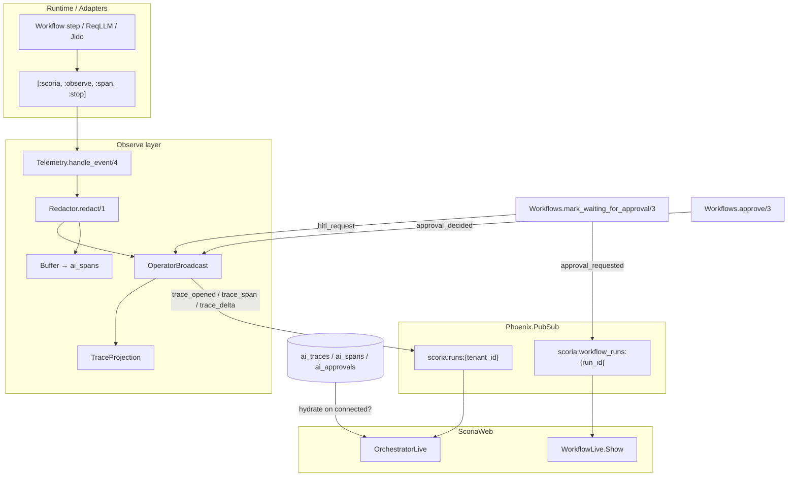

# Phase 01 Research — Orchestrator Live Wiring

**Researched:** 2026-05-30  
**Phase:** 01 — Orchestrator Live Wiring  
**Requirement:** ORCH-LIVE-01  
**Confidence:** HIGH

---

<user_constraints>

## Implementation Decisions

### PubSub architecture (D-113–D-115)

- **D-113:** Introduce `Scoria.Observe.OperatorBroadcast` as the **single tenant-scoped fan-out module** in the Observe layer (parallel API to `Workflows.subscribe_run/1` + `broadcast/2`). Do **not** put broadcast logic in `ScoriaWeb.*`.
- **D-114:** OrchestratorLive stays subscribed to **`scoria:runs:{tenant_id}`** (already wired). All operator-dashboard live events (trace deltas, HITL, optional token previews) publish to this topic. Defer optional `scoria:traces:{trace_id}` until a trace-detail LiveView exists.
- **D-115:** Preserve **dual broadcast**: run-scoped `scoria:workflow_runs:{run_id}` with `{:workflow_updated, _}` / `{:approval_requested, run_id, approval_id}` for `WorkflowLive.Show`; tenant-scoped fan-out for `OrchestratorLive`. Never subscribe OrchestratorLive to per-run topics.

### Trace projection & event source (D-116–D-119)

- **D-116:** Broadcast **incremental trace deltas**, not full snapshots on every span:
  - `{:trace_opened, header_map}` — first span for a trace (id, session_id, workflow_run_id, tenant_id)
  - `{:trace_span, trace_id, span_view_map}` — one completed span per message
  - Keep `{:new_trace, trace_map}` as a **test/migration shim** only (maps to opened + spans list).
- **D-117:** Add `Scoria.Observe.TraceProjection` to build UI-safe `span_view` maps (`id`, `name`, `span_kind`, `status_code`, `parent_id`, timing, `attributes_preview` capped/redacted) and `with_depths/1` for `TraceTreeComponent` (reuse depth algorithm from `WorkflowLive.Show`).
- **D-118:** Hook broadcast in **`Scoria.Observe.Telemetry.handle_event/4` immediately after `Redactor.redact/1`, before `Buffer.cast_span/1`. **Do not** hook at Buffer flush (5s default latency is unacceptable for live UI). Buffer remains durability-only.
- **D-119:** On `connected?(socket)`, **hydrate** recent traces for `tenant_id` from `ai_traces`/`ai_spans` (default limit 25, configurable), seed `:traces` stream, then merge PubSub deltas. PubSub alone is insufficient after LiveView reconnect.

**Required span metadata contract:** adapters and runtime must enrich `:span, :stop` metadata with `tenant_id`, `trace_id`, `parent_id`, and `workflow_run_id` before telemetry fires. Missing `tenant_id` → drop broadcast + debug log (fail closed on tenant topic).

### HITL approval wiring (D-120–D-124)

- **D-120:** After successful `Workflows.mark_waiting_for_approval/3`, fan-out to tenant topic:
  ```elixir
  OperatorBroadcast.hitl_request(tenant_id, projection)
  ```
  where `projection = RemoteApprovalProjection` map fetched for the inserted approval. Message tuple: **`{:hitl_request, projection_map}`** (matches existing OrchestratorLive handler shape, but projection not raw `%Approval{}`).
- **D-121:** Extend `RemoteApprovalProjection` with **`arguments_preview`** — redacted via `Scoria.Observe.Redactor` (never render raw `arguments` in DOM). Inbox rows and modal use the **same map shape**.
- **D-122:** Multi-operator safety:
  - `Workflows.approve/3` rejects when `status != "pending"` → `{:error, :not_pending}`
  - Map `StaleEntryError` to friendly flash: *"This approval was already decided by another operator."*
  - After successful approve/reject, broadcast **`{:approval_decided, approval_id, status}`** on tenant topic; OrchestratorLive clears stale `@active_approval` by id.
- **D-123:** **Blocking overlay modal** (Governors: Verification) for push-triggered approvals. Show: tool name, reason, redacted args preview, connector badge/scopes when `connector_label` or `blocker_kind == "connector"`, link to `/workflows/{workflow_run_id}`. **Dismiss ("Decide later")** closes modal without calling `approve/3`; item stays in inbox.
- **D-124:** **Hybrid UX:** push modal when `@active_approval` is nil OR new approval matches focused `@runtime_query`; otherwise inbox-only highlight. Single `@active_approval` — no modal stack. Reject footer copy: *"Reject records a durable rejection and keeps the workflow paused. To continue, the run needs a new approval request or operator retry."*

### Token streaming (D-125–D-128)

- **D-125:** **v2.11 acceptance gate** = live span/trace updates + real HITL. Character-level LLM token preview is **best-effort**, not release-blocking (ReqLLM adapter currently emits `:span, :stop` only).
- **D-126:** Replace global `@token_text` coalescer with **per-`span_id` buffers**; default **75ms** via `config :scoria, :live_token_coalesce_ms, 75`. Backpressure: cap ~256 buffered chunks per span between flushes (merge/drop intermediate).
- **D-127:** Remove global `#token-stream` strip. Show coalesced preview **only on the active LLM span row** in `TraceTreeComponent`; hide/freeze when span completes.
- **D-128:** Add telemetry event **`[:scoria, :observe, :span, :delta]`** (metadata: `tenant_id`, `trace_id`, `span_id`, `chunk`) → `OperatorBroadcast` → `{:trace_delta, %{trace_id, span_id, chunk}}`. Ship handler + UI slot in v2.11; ReqLLM/runtime streaming adapter can land in a follow-up without blocking ORCH-LIVE-01.

### Verification, reconnect & adopter DX (D-129–D-131)

- **D-129:** Add **`test/scoria_web/live/orchestrator_live_integration_test.exs`** proving ORCH-LIVE-01 via `Runtime.start_run` → LiveView DOM (`eventually` until modal/trace) **without `send/2`**. Register in `mix scoria.test.semantic_fast_path` file list (+ matching contract test). Keep existing `orchestrator_live_test.exs` `send/2` tests as **UI unit tier**. Do **not** widen `closeout_order/0`.
- **D-130:** Document host session contract in adoption fragments: host apps must set **`session["tenant_id"]`** and **`session["actor_id"]`** before `/scoria` so PubSub scoping and audit refs match runtime identity. **`mix scoria.install` unchanged** (auth-agnostic).
- **D-131:** One semantic-lane test: `render_disconnect` → trigger real approval → `render_reconnect` → modal visible from **DB catch-up** (pending approval projection on mount, not only PubSub).

### External patterns & footguns (locked principles)

- **Trace-first, calm control room:** Live span names/kinds/status/timing; lazy-load retrieval/incident/budget evidence via existing `assign_async` (do not broadcast raw prompts/responses).
- **Redact → broadcast → buffer:** PII/secrets never on PubSub; attribute previews capped; approval args always redacted in projection.
- **Idempotent LiveView merge:** upsert spans by `span.id`; ignore duplicate `trace_opened` if trace already in `trace_records`.
- **Workflow-owned HITL:** UI never calls `Resume.resume_run/1` before successful `approve/3`; reject never resumes (preserve existing guard).
- **Lessons applied:** LangGraph interrupt + Temporal durable signal model; GitHub PR stale-review UX for multi-operator; OpenAI Agents SDK separate run vs trace updates; avoid Langfuse polling-only "live" views and global chat-style token strips.

### Claude's Discretion

Planner may choose exact module file layout under `lib/scoria/observe/`, hydrate query limits, and plan wave split — bounded by decisions above.

### Suggested plan waves (non-binding)

| Wave | Focus |
|------|-------|
| **01-01** | `OperatorBroadcast` + `TraceProjection` + Telemetry hook + span metadata enrichment |
| **01-02** | HITL tenant fan-out + projection `arguments_preview` + multi-operator broadcasts + modal/inbox UX |
| **01-03** | DB hydrate on mount + integration tests + semantic lane pins + adoption doc fragment |

## Deferred Ideas

- **Separate `scoria:approvals:{tenant_id}` topic** — rejected for v2.11; single tenant runs topic is simpler (D-114)
- **`scoria:traces:{trace_id}` topic** — defer until trace-detail LiveView
- **Full ReqLLM streaming adapter** — stub delta telemetry in v2.11; adapter in follow-up
- **OTel export of operator PubSub events** — separate milestone
- **Multi-tab operator sync / approval claims via Presence** — v2.12+
- **Mobile-responsive HITL modal** — polish pass
- **Gallery `/scoria` landing smoke in advisory lane** — optional supplement to integration tests (D-126 note from research)
- **Global token strip** — remove (D-127)
- **Installer session key injection** — host-owned; document only (D-130)

</user_constraints>

---

<phase_requirements>

| Req ID | Description | Phase | Status | Acceptance signals |
|--------|-------------|-------|--------|-------------------|
| **ORCH-LIVE-01** | Runtime→PubSub trace broadcast and HITL modal from real approvals | 01 | Context gathered | (1) `OperatorBroadcast` emits trace/HITL on `scoria:runs:{tenant_id}` from telemetry + workflow success paths; (2) OrchestratorLive shows live spans + blocking modal without test `send/2`; (3) reconnect hydrates from DB; (4) integration test + semantic lane pin; (5) `closeout_order/0` unchanged |

</phase_requirements>

---

## Summary

Phase 01 closes the **HOLLOW_PROP** gap documented in v1 Phase 03 verification: `OrchestratorLive` already subscribes to `scoria:runs:{tenant_id}` and handles `{:new_trace, _}`, `{:token, _}`, and `{:hitl_request, _}`, but **no production producer** exists on that topic [VERIFIED: codebase grep — only subscriber references in `orchestrator_live.ex`]. Tests simulate PubSub with direct `send(view.pid, ...)` [CITED: `test/scoria_web/live/orchestrator_live_test.exs` L99–101, L301, L354].

Implementation adds an Observe-layer **tenant fan-out bridge** (`OperatorBroadcast` + `TraceProjection`) hooked at **telemetry span stop** (before the 5s Buffer flush), extends **workflow approval success** with tenant HITL broadcast, updates **OrchestratorLive** for incremental deltas + DB hydrate + multi-operator UX, and proves the path in a **new integration test** pinned to the semantic fast-path lane.

**Confidence:** HIGH — locked decisions (D-113–D-131) align with existing patterns (`Workflows.broadcast/2`, `Redactor`, `RemoteApprovalProjection`, `IntegrationCase` + `eventually/1`).

---

## Architectural Responsibility Map

| Layer | Module / artifact | Responsibility | Current state |
|-------|-------------------|----------------|---------------|
| **Observe** | `Scoria.Observe.OperatorBroadcast` | Tenant-scoped `Phoenix.PubSub.broadcast/3` to `scoria:runs:{tenant_id}` | **Missing** [VERIFIED: grep] |
| **Observe** | `Scoria.Observe.TraceProjection` | UI-safe span maps, `attributes_preview`, `with_depths/1` | **Missing** [VERIFIED: grep] |
| **Observe** | `Scoria.Observe.Telemetry` | Attach `[:scoria, :observe, :span, :stop]`; redact → **broadcast** → buffer | Broadcast hook **missing**; only redact → buffer today [CITED: `lib/scoria/observe/telemetry.ex` L18–21] |
| **Observe** | `Scoria.Observe.Buffer` | Durability batch insert to `ai_spans` (5s flush) | Exists; **not** in `Application` children [CITED: `lib/scoria/application.ex`, `lib/scoria/observe/buffer.ex` L6] |
| **Observe** | `Scoria.Observe.Redactor` | Scrub PII/secrets before persistence/broadcast | Exists; used by Telemetry [CITED: `lib/scoria/observe/redactor.ex`] |
| **Observe adapters** | `ReqLLM`, `Jido` | Emit normalized span maps to `[:scoria, :observe, :span, :stop]` | Emit `trace_id` only; **no `tenant_id`, `parent_id`, `workflow_run_id`** [CITED: `lib/scoria/observe/adapters/req_llm.ex` L12–23] |
| **Workflows** | `Scoria.Workflows` | Run-scoped PubSub + approval lifecycle | Run-scoped broadcast exists; **no tenant HITL fan-out** [CITED: `lib/scoria/workflows.ex` L418, L752–753] |
| **Workflows** | `RemoteApprovalProjection` | Inbox/modal DTO | Missing `arguments_preview`, `connector_label` in projection map [CITED: `lib/scoria/workflows/remote_approval_projection.ex` L39–80] |
| **Web** | `ScoriaWeb.OrchestratorLive` | Subscribe, merge traces, HITL modal, inbox | Handlers exist; needs delta handlers, hydrate, hybrid modal, `approval_decided` [CITED: `lib/scoria_web/live/orchestrator_live.ex`] |
| **Web** | `ScoriaWeb.TraceTreeComponent` | Flat CSS-grid span tree | Expects `spans` with `:depth`; no per-span token slot yet [CITED: `lib/scoria_web/components/trace_tree_component.ex`] |
| **Repo** | `Scoria.Repo.Trace`, `Scoria.Repo.Span` | Hydrate source for reconnect | No `tenant_id` column on `ai_traces`; filter via `attributes` JSON or span attrs [CITED: `priv/repo/migrations/20260510015813_create_ai_observability_tables.exs`] |
| **Test** | `orchestrator_live_integration_test.exs` | End-to-end ORCH-LIVE-01 without `send/2` | **Missing** (D-129) |
| **Test** | `orchestrator_live_test.exs` | UI unit tier with `send/2` | Exists; keep as unit tier [CITED: D-129] |
| **CI contract** | `Mix.Tasks.Scoria.Test.SemanticFastPath` | Bounded semantic lane file list | Pin location for new integration test [CITED: `lib/mix/tasks/scoria.test.semantic_fast_path.ex` L7–16] |

---

## Standard Stack

| Component | Version / choice | Notes |
|-----------|------------------|-------|
| Elixir | `~> 1.19` | [CITED: `mix.exs` L11] |
| Phoenix | `~> 1.7` | Embedded dashboard, PubSub server `Scoria.PubSub` [CITED: `mix.exs` L71, `lib/scoria/application.ex` L15] |
| Phoenix LiveView | `~> 1.0` | `connected?/1` subscribe pattern, `stream/3`, `assign_async/3` [CITED: `orchestrator_live.ex` L36–38, L65] |
| Phoenix PubSub | Via Phoenix | Direct message delivery to `handle_info/2` (same as `Workflows.broadcast/2`) [CITED: `lib/scoria/workflows.ex` L752–753] |
| Ecto / PostgreSQL | `ecto_sql ~> 3.10` | Trace/span/approval persistence |
| :telemetry | Elixir stdlib | Event bus for observe pipeline |
| ExUnit + LiveViewTest | Test stack | `Scoria.IntegrationCase`, `eventually/1`, dedicated Endpoint pattern [CITED: `test/support/scoria/integration_case.ex`, `test/scoria/runtime_integration_test.exs`] |

**Package Legitimacy Audit:** N/A — no new npm packages; Elixir/Hex deps unchanged.

---

## Architecture Patterns

### Data-flow (target state)



### Locked patterns (do not re-litigate)

1. **Context modules own topic prefixes** — mirror `Workflows.@topic_prefix` with `OperatorBroadcast` tenant prefix `scoria:runs:` [CITED: `.planning/PATTERNS.md`, D-113].
2. **Subscribe only when `connected?(socket)`** — already correct in OrchestratorLive [CITED: `orchestrator_live.ex` L36–38].
3. **Redact → broadcast → buffer** — Telemetry ordering per D-118 [CITED: `prompts/phoenix-ai-lib-deep-research.md` §8.3, §9.2–9.3].
4. **Dual broadcast** — run-scoped for workflow detail; tenant-scoped for orchestrator [D-115].
5. **Coalesce high-frequency UI events** — 75ms token coalesce (extend to per-span per D-126) [CITED: research brief §9.3 footguns].
6. **Integration tests: real runtime, no `send/2`** — precedent in `runtime_integration_test.exs` [CITED: `test/scoria/runtime_integration_test.exs` L115–203].

### Message contract on `scoria:runs:{tenant_id}`

| Message | Producer | Consumer action |
|---------|----------|-----------------|
| `{:trace_opened, header_map}` | `OperatorBroadcast` (first span for trace) | Insert trace into `trace_records` + `stream_insert` |
| `{:trace_span, trace_id, span_view}` | `OperatorBroadcast` (each span stop) | Upsert span in trace map; recompute depths |
| `{:trace_delta, %{trace_id, span_id, chunk}}` | `OperatorBroadcast` (span delta telemetry) | Per-span token buffer coalesce (D-128) |
| `{:hitl_request, projection_map}` | `OperatorBroadcast` after `mark_waiting_for_approval/3` | Hybrid modal / inbox highlight |
| `{:approval_decided, approval_id, status}` | `OperatorBroadcast` after successful `approve/3` | Clear `@active_approval` if id matches |
| `{:new_trace, trace_map}` | Test shim only | Map to opened + spans (migration) |

### Hydrate strategy (D-119 — planner discretion within bounds)

`ai_traces` has `session_id` and `attributes` (JSONB GIN index) but **no `tenant_id` column** [CITED: migration]. Practical options bounded by locked decisions:

- **Preferred:** Query traces where `attributes->>'tenant_id' = ^tenant_id` (requires Buffer/Telemetry to persist `tenant_id` into trace/span attributes — align with metadata contract).
- **Fallback for v2.11:** Join recent spans whose `attributes->>'tenant_id'` matches, group by `trace_id`, limit 25 traces by latest span `end_time`.
- **Approvals hydrate:** Already partially covered — `load_operator_surface/1` calls `Workflows.list_pending_remote_approvals(%{tenant_id: tenant_id})` on mount and after decisions [CITED: `orchestrator_live.ex` L870–903]. Reconnect modal (D-131) can seed `@active_approval` from pending list + hybrid rules.

Default limit: **25** traces (configurable via `config :scoria, :orchestrator_hydrate_trace_limit, 25` — planner discretion).

---

## Don't Hand-Roll

| Problem | Use instead | Why |
|---------|-------------|-----|
| Tenant PubSub fan-out | `Phoenix.PubSub.broadcast/3` via `OperatorBroadcast` | Same proven pattern as `Workflows.broadcast/2` [CITED: `workflows.ex` L752–753] |
| PII scrubbing | `Scoria.Observe.Redactor` | Already wired; extend for `arguments_preview` caps [D-121] |
| Span tree depths | Port `WorkflowLive.Show.decorate_steps/1` algorithm | `depth_for/3` recursive parent walk [CITED: `workflow_live/show.ex` L314–328] |
| Async evidence panels | Existing `assign_async/3` in OrchestratorLive | Do not broadcast raw retrieval/incident payloads [D locked principles] |
| LiveView reconnect catch-up | DB hydrate + pending approval list | PubSub alone loses messages during disconnect [CITED: research brief §9.3] |
| Integration polling | `Scoria.TestSupport.Eventually.eventually/1` | Used across runtime + orchestrator tests [CITED: `test/support/scoria/eventually.ex`] |
| Approval DTO | Extend `RemoteApprovalProjection.project_approval/1` | Single map for inbox + modal [D-121] |

---

## Common Pitfalls

| Pitfall | Evidence in codebase | Mitigation (locked) |
|---------|---------------------|---------------------|
| **Hooking broadcast at Buffer flush** | 5s default `@default_flush_interval 5000` [CITED: `buffer.ex` L6] | Hook in Telemetry before `Buffer.cast_span/1` [D-118] |
| **Missing `tenant_id` on spans** | ReqLLM adapter emits no tenant [CITED: `req_llm.ex`] | Enrich metadata at adapter/runtime; drop broadcast if missing [D-119] |
| **Broadcasting raw approval arguments** | Modal currently shows tool only; projection includes raw `arguments` key absent from DOM but struct passed in tests | Add `arguments_preview` via Redactor; never render raw `arguments` [D-121] |
| **Test `send/2` masking hollow wiring** | All trace/HITL tests use `send(view.pid, ...)` [CITED: `orchestrator_live_test.exs`] | New integration test without `send/2` [D-129] |
| **Buffer not started in host app** | Not in `Application` children [CITED: `application.ex`] | Document in adoption fragment; tests start Buffer in setup (existing `telemetry_test.exs` pattern) |
| **Subscribing OrchestratorLive to per-run topics** | WorkflowLive uses run topic [CITED: `workflow_live/show.ex` L23] | Never subscribe orchestrator to run topics [D-115] |
| **Double resume on reject** | `maybe_resume_approval/3` guards non-approved [CITED: `orchestrator_live.ex` L802–803] | Preserve; reject never calls `Resume.resume_run/1` |
| **Stale approval race** | `approve/3` has no `not_pending` guard today [VERIFIED: `workflows.ex` L630–687] | Add guard + `approval_decided` broadcast [D-122] |
| **Global token strip DOM bloat** | `#token-stream` global assign [CITED: `orchestrator_live.ex` L212] | Remove; per-span preview in TraceTreeComponent [D-127] |
| **Widening CI closeout** | `@closeout_order` is `[:release_preview, :adoption, :runtime_to_handoff]` [CITED: `verification_lanes.ex` L74] | Pin integration test in semantic lane only [D-129] |

---

## Code Examples (from Scoria)

### Existing run-scoped broadcast (mirror for tenant module)

```752:754:lib/scoria/workflows.ex
  defp broadcast(run_id, message) do
    Phoenix.PubSub.broadcast(Scoria.PubSub, @topic_prefix <> run_id, message)
  end
```

`OperatorBroadcast` should expose `tenant_topic/1`, `broadcast/2`, and named helpers (`span_stopped/1`, `hitl_request/2`, `approval_decided/3`) targeting `"scoria:runs:#{tenant_id}"`.

### Telemetry hook point (insert broadcast between redact and buffer)

```18:21:lib/scoria/observe/telemetry.ex
  def handle_event([:scoria, :observe, :span, _type], _measurements, metadata, %{buffer_name: buffer_name}) do
    redacted_metadata = Redactor.redact(metadata)
    Buffer.cast_span(redacted_metadata, buffer_name)
  end
```

Target:

```elixir
redacted = Redactor.redact(metadata)
OperatorBroadcast.span_stopped(redacted)  # no-op if tenant_id missing
Buffer.cast_span(redacted, buffer_name)
```

### OrchestratorLive subscribe + hollow handlers

```36:38:lib/scoria_web/live/orchestrator_live.ex
    if connected?(socket) do
      Phoenix.PubSub.subscribe(Scoria.PubSub, "scoria:runs:#{tenant_id}")
      Phoenix.PubSub.subscribe(Scoria.PubSub, "mcp:runtimes:#{tenant_id}")
```

```74:114:lib/scoria_web/live/orchestrator_live.ex
  def handle_info({:new_trace, trace}, socket) do
    socket =
      socket
      |> assign(:trace_records, Map.put(socket.assigns.trace_records, trace.id, trace))
      |> stream_insert(:traces, trace)

    {:noreply, socket}
  end
  ...
  def handle_info({:hitl_request, approval}, socket) do
    {:noreply,
     socket
     |> assign(:active_approval, approval)
     |> load_operator_surface()}
  end
```

Planner must add handlers for `{:trace_opened, _}`, `{:trace_span, _, _}`, `{:approval_decided, _, _}`, optional `{:trace_delta, _}`, and idempotent merge logic.

### Depth algorithm to reuse in TraceProjection

```314:328:lib/scoria_web/live/workflow_live/show.ex
  defp decorate_steps(steps) do
    parent_map = Map.new(steps, &{&1.id, &1})

    Enum.map(steps, fn step ->
      Map.put(step, :depth, depth_for(step, parent_map, 0))
    end)
  end

  defp depth_for(%{parent_step_id: nil}, _parent_map, depth), do: depth

  defp depth_for(step, parent_map, depth) do
    case Map.get(parent_map, step.parent_step_id) do
      nil -> depth
      parent -> depth_for(parent, parent_map, depth + 1)
    end
  end
```

Adapt keys: `parent_id` on span maps instead of `parent_step_id`.

### Integration test scaffold (from runtime_integration_test.exs)

```159:176:test/scoria/runtime_integration_test.exs
  test "operator-visible workflow page stays aligned with the public runtime contract" do
    {:ok, started} =
      Scoria.start_run(
        %{actor_id: "live-actor", tenant_id: "live-tenant", session_id: "live-session"},
        root_role_id: "executor",
        initial_step: %{sequence: 1, kind: "approval", role_id: "executor", status: "queued"},
        handlers: %{"approval" => {Handlers, :wait_for_approval}}
      )

    conn =
      build_conn()
      |> Plug.Test.init_test_session(%{
        "actor_id" => "operator-integration",
        "tenant_id" => "tenant-integration"
      })
      |> Plug.Conn.put_private(:phoenix_endpoint, Scoria.RuntimeIntegrationTest.Endpoint)

    {:ok, view, _html} = live(conn, AdoptionExample.operator_route(started.run_id))
```

New integration test should:

1. Match **session `tenant_id`** to runtime identity tenant (critical for PubSub topic alignment).
2. Mount `/scoria` (orchestrator route), not only workflow show.
3. Use `eventually/1` on DOM for trace span names and approval modal — **no `send(view.pid, ...)`**.
4. Start Telemetry + Buffer in `setup` (mirror `telemetry_test.exs`).

### mark_waiting_for_approval success path (HITL fan-out insertion point)

```415:419:lib/scoria/workflows.ex
    |> case do
      {:ok, {run, approval, audit_outbox_event}} ->
        SRE.emit_audit_outbox_telemetry(audit_outbox_event)
        broadcast(run.id, {:approval_requested, run.id, approval.id})
        {:ok, approval}
```

After line 418, add tenant fan-out:

```elixir
projection = RemoteApprovalProjection.get_approval_lineage!(approval.id)
OperatorBroadcast.hitl_request(approval.tenant_id, projection)
```

---

## Validation Architecture

Nyquist **enabled** for Phase 01: ORCH-LIVE-01 maps to executable ExUnit commands, semantic fast-path lane pins, and integration tests proving producer paths (not UI-only `send/2`).

### Test framework

| Property | Value |
|----------|-------|
| Framework | ExUnit |
| Integration base | `Scoria.IntegrationCase` (`async: false`, Sandbox shared, Reconciler) |
| LiveView | Dedicated test Endpoint + session keys `tenant_id`, `actor_id` |
| Polling | `Scoria.TestSupport.Eventually.eventually/1` (default 5s, env override) |
| Semantic lane | `mix test.semantic_fast_path` / `mix scoria.test.semantic_fast_path` |
| Closeout lanes | **Unchanged** — `VerificationLanes.closeout_order/0` → `[:release_preview, :adoption, :runtime_to_handoff]` |
| Postgres | Required (trace/span/approval hydrate) |

### Requirement → test map

| Req ID | Behavior | Test type | Command | Exists? |
|--------|----------|-----------|---------|---------|
| **ORCH-LIVE-01** | Telemetry → tenant PubSub → LiveView trace DOM | integration | `mix test test/scoria_web/live/orchestrator_live_integration_test.exs` | ❌ add (D-129) |
| **ORCH-LIVE-01** | Real approval → modal without `send/2` | integration | same file | ❌ add |
| **ORCH-LIVE-01** | Reconnect → modal from DB hydrate | integration | same file (`render_disconnect` / `render_reconnect`) | ❌ add (D-131) |
| **ORCH-LIVE-01** | OperatorBroadcast unit: drops missing tenant_id | unit | `mix test test/scoria/observe/operator_broadcast_test.exs` | ❌ add |
| **ORCH-LIVE-01** | TraceProjection redaction + depths | unit | `mix test test/scoria/observe/trace_projection_test.exs` | ❌ add |
| **ORCH-LIVE-01** | Telemetry ordering: broadcast before buffer | unit | extend `test/scoria/observe/telemetry_test.exs` | ❌ extend |
| **ORCH-LIVE-01** | Semantic lane file list includes integration test | contract | `mix test test/mix/tasks/test.semantic_fast_path_test.exs` | ❌ extend |
| **ORCH-LIVE-01** | UI unit tier preserved | unit | `mix test test/scoria_web/live/orchestrator_live_test.exs` | ✅ exists |
| **Preserved** | `closeout_order/0` unchanged | contract | `mix test test/scoria/verification_lanes_test.exs` | ✅ |
| **Preserved** | Runtime integration contract | integration | `mix test test/scoria/runtime_integration_test.exs` | ✅ |

### Semantic fast-path lane (D-129)

Current pin list [CITED: `lib/mix/tasks/scoria.test.semantic_fast_path.ex` L7–16]:

- `test/scoria_web/live/orchestrator_live_test.exs` (unit tier — keep)
- **Add:** `test/scoria_web/live/orchestrator_live_integration_test.exs`
- **Update:** `test/mix/tasks/test.semantic_fast_path_test.exs` expected_files

Lane runs in PR CI **after** closeout lanes (`mix test.semantic_fast_path --warnings-as-errors`) [CITED: `.github/workflows/ci-verify.yml`, `docs/operator_verification.md`] — not in `closeout_order/0`.

### Sampling rate (plan waves)

| When | Command |
|------|---------|
| After 01-01 (Observe modules) | `MIX_ENV=test mix test test/scoria/observe/operator_broadcast_test.exs test/scoria/observe/trace_projection_test.exs test/scoria/observe/telemetry_test.exs` |
| After 01-02 (HITL fan-out) | `MIX_ENV=test mix test test/scoria/workflows_test.exs --only approval` (or targeted approve/not_pending tests) |
| After 01-03 (integration) | `MIX_ENV=test mix test test/scoria_web/live/orchestrator_live_integration_test.exs` |
| **Phase gate** | `SCORIA_DB_PORT=55432 SCORIA_DB_PASSWORD=postgres MIX_ENV=test mix test.semantic_fast_path --warnings-as-errors` |
| Closeout guard | `MIX_ENV=test mix test test/scoria/verification_lanes_test.exs` |

### Failure triage

| Symptom | First check |
|---------|-------------|
| Integration test timeout on trace | Telemetry attached? Buffer flushing? `tenant_id` in span metadata? |
| Modal never appears | Session `tenant_id` matches approval `tenant_id`? `OperatorBroadcast.hitl_request/2` called? |
| Reconnect test fails | `load_operator_surface/1` + pending approvals on mount; hydrate limit |
| Semantic lane contract fail | `semantic_fast_path_test_files/0` list out of sync |
| Cross-tenant leak | PubSub topic uses runtime tenant, not `"default"` fallback |

---

## Security Domain

Phase 01 introduces **live PubSub fan-out of operational telemetry and approval metadata**. Relevant OWASP ASVS themes:

| ASVS area | Threat | Phase 01 control |
|-----------|--------|------------------|
| **V4 Access control** | Cross-tenant trace/HITL visibility via wrong topic | Tenant-scoped topic `scoria:runs:{tenant_id}`; drop broadcast when `tenant_id` missing [D-114, D-119]; session `tenant_id` must match runtime identity [D-130] |
| **V8 Data protection** | PII/secrets on PubSub or in DOM | `Redactor` before broadcast; `arguments_preview` capped/redacted; no raw prompts/responses on wire [D-121, locked principles] |
| **V9 Communication** | LiveView/PubSub message tampering | PubSub is server-side fan-out within BEAM cluster; host app responsible for auth on `/scoria` route (auth-agnostic installer [D-130]) |
| **V11 Business logic** | Double approval / stale operator action | `approve/3` `not_pending` guard; `approval_decided` broadcast; friendly stale flash [D-122] |
| **V13 API / UI** | HITL modal side-effects without context | Blocking verification modal with tool, reason, redacted args, workflow link [D-123]; reject does not resume [workflow-owned HITL] |

### STRIDE (operator dashboard path)

| Category | Scenario | Mitigation |
|----------|----------|------------|
| **Spoofing** | Operator acts with wrong `actor_id` | Session `actor_id` passed to `approve/3` attrs [CITED: `orchestrator_live.ex` L816–824]; document host contract [D-130] |
| **Tampering** | Raw tool arguments exfiltrated via DOM | `arguments_preview` only; Redactor on approval args |
| **Repudiation** | Approval decision denied | Existing audit outbox on approve/reject [CITED: `workflows.ex` L647–675] — preserve |
| **Information disclosure** | Span attributes leak secrets | Redactor deny list + preview cap in TraceProjection |
| **Denial of service** | Token delta flood re-renders LiveView | Per-span coalesce 75ms, 256 chunk cap [D-126] |
| **Elevation** | Cross-tenant subscription | Fail closed on missing tenant_id; never use global `scoria:runs:all` |

Host apps **must** set `session["tenant_id"]` and `session["actor_id"]` before mounting `/scoria` [D-130]. Scoria does not inject auth plugs via `mix scoria.install` — adoption doc fragment only.

---

## Open Questions for Planner (within discretion bounds)

1. **Hydrate query shape** — `attributes->>'tenant_id'` vs join through `ai_audit_outbox_events.trace_id` (prefer attributes if Buffer persists tenant on span insert).
2. **Application supervision** — whether to add `Observe.Buffer` + `Telemetry.attach/0` to `Scoria.Application` for production host apps, or document explicit host startup (CONTEXT notes Buffer may not be started [CITED: 01-CONTEXT.md code_context]).
3. **Trace header fields** — store `workflow_run_id` on trace `attributes` at first span for badge buttons (`load_budget_state`, etc.) that already expect `trace[:workflow_run_id]`.
4. **`connector_label` in projection** — Approval schema has field; add to `project_approval/1` for inbox/modal badge [D-123].
5. **Wave split** — follow suggested 01-01/01-02/01-03 table or combine 01-02+01-03 if integration tests drive both HITL and hydrate.

---

## Sources

- `.planning/phases/01-orchestrator-live-wiring-runtime-pubsub-trace-broadcast-and-/01-CONTEXT.md` — locked D-113–D-131 [CITED]
- `.planning/REQUIREMENTS.md` — ORCH-LIVE-01 [CITED]
- `.planning/ROADMAP.md`, `.planning/STATE.md` [CITED]
- `prompts/phoenix-ai-lib-deep-research.md` — §8.3 redaction, §9.2–9.3 LiveView/PubSub, §9.3 footguns [CITED]
- `lib/scoria_web/live/orchestrator_live.ex` [VERIFIED: codebase]
- `lib/scoria/observe/telemetry.ex`, `buffer.ex`, `redactor.ex` [VERIFIED: codebase]
- `lib/scoria/workflows.ex`, `remote_approval_projection.ex` [VERIFIED: codebase]
- `test/scoria_web/live/orchestrator_live_test.exs`, `test/scoria/runtime_integration_test.exs` [VERIFIED: codebase]
- `lib/mix/tasks/scoria.test.semantic_fast_path.ex` [VERIFIED: codebase]
- `.planning/milestones/v1.0-phases/03-liveview-operator-ux/03-VERIFICATION.md` — HOLLOW_PROP definition [CITED]
